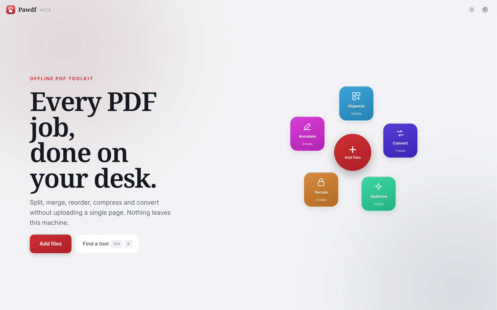

<p align="center">
  
</p>

<h1 align="center">Pawdf</h1>

<p align="center"><em>Offline PDF tools, clawed and ready.</em></p>

<p align="center">
  
  
  
  
  
</p>

**Pawdf** is a free, open-source, fully offline desktop app for everyday PDF
work: split, merge, reorder, compress, and convert. No upload, no account, no
telemetry, no subscription.

It is also built to be **taken apart**. Every operation is a self-contained
package you can copy into your own project - including a closed-source one -
with attribution as the only obligation.



<!-- PAWDF_DOC_SYNC_2026_08:current-ui -->

The screenshot is generated from the current source build. The landing view
uses an expanded responsive hero, the generated mark has three miniature
document-shaped paw pads, and tool tiles remain upright both while orbiting
and after a tool panel opens.

---

## 🐾 One screen, no tabs

**Add a file, then pick what to do with it.** The button in the middle adds
files - it is not a menu toggle. Until something is in the tray the tools stay
dimmed, because there is nothing for them to act on.

Once a file is there, the ring tells you what is possible before you click
anything: add a `.docx` and only **Word to PDF** lights up; add a PDF and the
seven tools that read PDFs come alive. Choose one and the workspace slides
left while that tool's options open on the right - your files never leave the
screen, so you can reorder or swap them without going back.

Every tool has its own colour, and the whole tile carries it, so the ring is
learned by position and hue rather than by reading eight labels. It drifts
slowly around the centre and pauses the moment your cursor enters it. Each
tile counter-rotates while moving, and both rotation layers reset to the same
upright transform when a tool opens, so a clicked tile never freezes at an
angle.

**See the pages before you act.** Every single-PDF tool shows a thumbnail
strip, so you never have to open the file elsewhere to remember what is on
page 7. Click any page to view it full size. In Split, scissors controls between thumbnails define exact cut points and preview every output file.

**Fast output with explicit control.** Results are first written safely to your Downloads folder under collision-safe names. Each output can then be saved individually, saved together, or continued into another compatible tool. Set `PAWDF_OUTPUT_DIR` to change the working destination.

Drop files anywhere in the window. `Ctrl+O` adds files, `1`-`8` jump to a
tool, `Esc` closes it, `F11` is full screen. The window remembers its size
between launches; the tool ring and the larger editorial hero both scale with
the viewport. Light is the default and dark mode is available on request.
Inter and Noto Serif are bundled, so no font or visual asset is fetched at
runtime.

## 📄 What it does

**22 tools**, grouped into five categories.

| | |
|---|---|
| **Organize** | Split · Merge · Arrange · Rotate · Crop |
| **Convert** | PDF to Images · Images to PDF · PDF to Word · PDF to Markdown · Word to PDF · Excel to PDF · PowerPoint to PDF |
| **Optimize** | Compress · OCR · Repair |
| **Secure** | Protect · Unlock · Watermark · Sign |
| **Annotate** | Page numbers · Fill form · Annotate |

A few worth calling out:

- **PDF to Markdown** reconstructs headings, emphasis and lists, and writes
  images to a folder beside the `.md`. Made for notes, wikis and feeding
  documents to language models.
- **OCR** makes a scanned PDF searchable by putting recognised text
  *invisibly behind* the original image, so the page still looks like the scan.
  Needs [Tesseract](https://github.com/tesseract-ocr/tesseract) installed; the
  tool tells you the command for your platform if it isn't.
- **Protect** uses AES-256. The panel is explicit that the password is real
  protection while the print/copy permissions are only a request compliant
  readers honour.
- **Repair** verifies its own work: it re-opens the result with recovery
  disabled and tells you if the damage outlived the attempt.

See [`docs/conversion_fidelity.md`](docs/conversion_fidelity.md) for exactly what
survives each conversion. They are best-effort by design: the point is *not*
needing Word, Excel, PowerPoint or LibreOffice installed.

## 📦 Install

Pawdf releases are pre-built. A new laptop does **not** need Git, Python, pip,
a compiler, a virtual environment, PyInstaller, or the source repository.

### Linux

```bash
curl -fsSL https://raw.githubusercontent.com/aniceswan/Pawdf/main/install.sh | bash
```

The installer verifies SHA-256, installs the AppImage for the current user,
and creates an application-menu launcher. It does not use `sudo`. Only
`x86_64` is currently published; `aarch64` is deferred (see CHANGELOG.md) and
the installer exits with a clear message rather than downloading a file that
does not exist.

### Windows

```powershell
[Net.ServicePointManager]::SecurityProtocol = [Net.ServicePointManager]::SecurityProtocol -bor [Net.SecurityProtocolType]::Tls12
irm https://raw.githubusercontent.com/aniceswan/Pawdf/main/install.ps1 | iex
```

The first line forces TLS 1.2, which Windows PowerShell 5.1 (the default
`powershell.exe`, as opposed to `pwsh`) does not always enable on its own;
without it, the download can fail silently and `iex` reports a confusing
"cannot call a method on a null-valued expression" instead of a clear
network error.

The installer verifies SHA-256 and installs under
`%LOCALAPPDATA%\Programs\Pawdf` without administrator rights. Windows ARM64
uses the x64 release through built-in emulation.

### macOS

```bash
curl -fsSL https://raw.githubusercontent.com/aniceswan/Pawdf/main/install.sh | bash
```

The installer selects the Apple Silicon or Intel DMG, verifies it, and copies
`Pawdf.app` to `~/Applications`.

Running the same command again updates Pawdf. Remove it with `--uninstall` on
Linux/macOS or `-Uninstall` in the PowerShell installer.

### Build from source

Source installation is for contributors:

```bash
git clone https://github.com/aniceswan/Pawdf.git
cd Pawdf
python -m venv .venv
.venv/bin/python -m pip install -e ".[dev]"
.venv/bin/python -m pawdf
```

See [`docs/distribution.md`](docs/distribution.md) for artifact names, size
policy, fresh-install QA, optional OCR/Ghostscript runtime details, and signing.

### Distribution status

<!-- PAWDF_DOC_SYNC_2026_08:platform-status -->

Hosted distribution QA builds and fresh-installs Linux x86_64, Windows
x86_64, macOS Apple Silicon, and macOS Intel. It checks all 22 feature
imports, packaged startup, final installer behavior, checksums, and runtime
size budgets. This is **not a substitute** for physical-device, SmartScreen,
Gatekeeper, accessibility, or hardware-specific verification; those remain
unverified until tested with real publisher certificates and physical machines.

Linux aarch64 is deferred: the aarch64 QtWebEngine runtime hit a chain of
missing codec dependencies (libopus, libevent, libwebp/libvpx) during the
real 5-target release run, so the current release ships four targets rather
than five. `install.sh` detects `aarch64` and exits with a clear message
instead of downloading an asset that does not exist.

```bash
bash scripts/test_all_os.sh
```

## 🧩 Take just the part you need

`core/` is **19 independent feature packages** plus one small shared base. **No feature
imports another feature.**

```
src/pawdf/core/
  _shared/     errors, path helpers, page-range parsing, pikepdf open/close
  split/       merge/       organize/    rotate/      crop/
  compress/    ocr/         repair/      protect/     stamp/
  rasterize/   imagepdf/    forms/       annotate/
  pdf_to_docx/ pdf_to_markdown/ docx_to_pdf/ xlsx_to_pdf/ pptx_to_pdf/
  registry.py  describes every tool without importing any of them
```

Nineteen packages, 22 tools: `core/stamp/` backs Watermark, Sign and Page
numbers from one overlay engine, and `core/protect/` backs both Protect and
Unlock.

Want just the splitter in your own project? Copy `core/split/` and
`core/_shared/`, then `pip install pikepdf`. That's the whole procedure.
Every feature has a **README** stating exactly what it depends on and what
licenses come with it - see [`core/split/README.md`](src/pawdf/core/split/README.md)
for the shape of it.

Qt is **not** a base dependency: `pip install pawdf` gives you every PDF
operation with no LGPL anywhere in the tree. The desktop window is the opt-in
extra, not the other way round:

```bash
pip install "pawdf[split]"        # just pikepdf
pip install "pawdf[pdf_to_docx]"  # pypdfium2 + python-docx
pip install "pawdf[core]"         # every feature, no GUI, no Qt
pip install "pawdf[gui]"          # ...and the desktop app on top
```

Both promises are **enforced by tests**, not just documented
([`tests/test_architecture.py`](tests/test_architecture.py)):

- `core/` imports no GUI toolkit - CI installs `.[core]` with no Qt at all and
  runs the suite.
- No feature imports a sibling feature.
- Every feature has a README explaining how to lift it out.
- No copyleft-by-linking dependency can reappear in `core/`.

## 🛡️ Production hardening

Pawdf validates untrusted inputs before parsing them, rejects unsafe Office archives and unreasonable PDF/image sizes, keeps small local rotating logs, exports privacy-preserving diagnostic bundles, restores the tray after a restart, and finishes active writes before closing. Release artifacts are smoke-tested and ship with SHA-256 checksums and a CycloneDX SBOM.

Real-device and real-document verification is tracked separately so a successful CI build is never presented as hardware validation. See [`docs/production_readiness.md`](docs/production_readiness.md) and the platform checklists under [`docs/qa/`](docs/qa/).

## ⚖️ License

**[MIT](LICENSE).** Fork it, modify it, sell it, ship it closed-source.

That was a deliberate engineering constraint, not a checkbox. The obvious
libraries for this job would have forced copyleft onto anyone who used it, so
they were each replaced:

| Instead of | Pawdf uses | Why |
|---|---|---|
| PyMuPDF (AGPL/commercial) | **pypdfium2** (BSD-3/Apache-2.0) | Same renderer Chromium ships |
| `pdf2docx` (needs PyMuPDF) | **`core/pdf_to_docx/`**, written here | Drags AGPL in transitively |
| `img2pdf` (LGPL-3.0) | **`core/imagepdf/`**, written here | Removes the last LGPL dependency from `core/` |

The result: **`core/` has zero copyleft dependencies.** Everything it touches
is MIT, BSD, Apache-2.0, HPND, or MPL-2.0 (file-level only, and only if you
modify pikepdf's own source). If you lift a feature into a proprietary product,
attribution is the entire obligation.

The desktop shell is a separate matter: **PySide6 is LGPL-3.0**. That still
permits closed-source products, but attaches conditions to how you *distribute*
builds - which is why packaging uses PyInstaller `--onedir`, so the Qt
libraries stay replaceable. If you don't want that obligation at all, take
`core/` and write your own UI; it has no idea Qt exists.

**Ghostscript is AGPL** and is never bundled - it's invoked as a separate
process only if you installed it yourself, with a pure-Python fallback
otherwise.

[**THIRD-PARTY-NOTICES.md**](THIRD-PARTY-NOTICES.md) spells out exactly what
shipping a build obliges you to do.

---

<p align="center"><sub>made with 🐾 and far too many hours staring at a scissors icon</sub></p>
